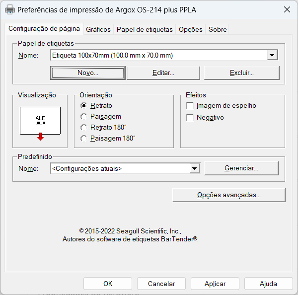
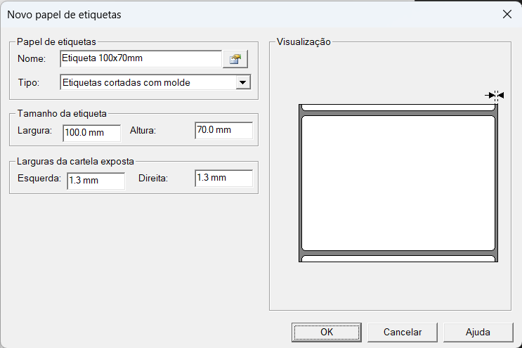
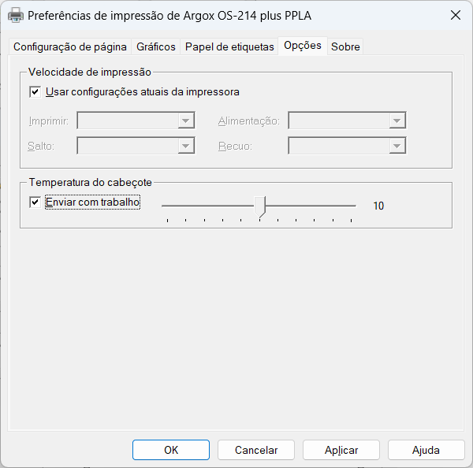

# Configuração de impressora Argox

Configurações para impressora térmica de etiquetas Argox.

Antes de fazer as configurações é necessário que o driver da impressora esteja instalado.

<https://www.argox.com/products>

## Configuração do papel

Na tela de preferências da impressora, clique em "Novo...".

Informe um nome para a etiqueta e as medidas em mm e clique em "OK".

As medidas têm que bater exatamente com as medidas da etiqueta, inclusive as bordas.

## Temperatura da impressão

Caso a impressão esteja muito clara, um aumento na temperatura de impressão pode resolver.

Clique na aba "Opções", ative a opção "Temperatura do cabeçote > Enviar com trabalho" e ajuste a temperatura.

