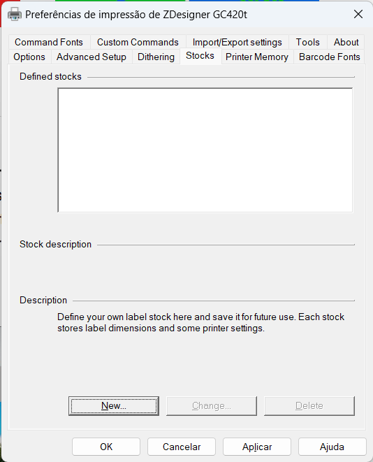
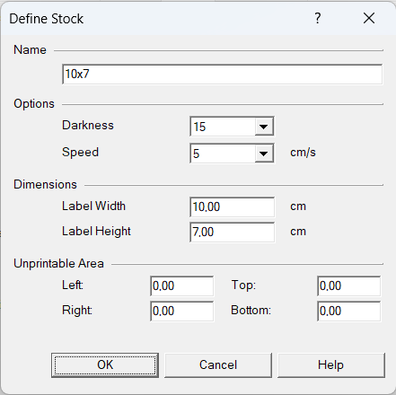
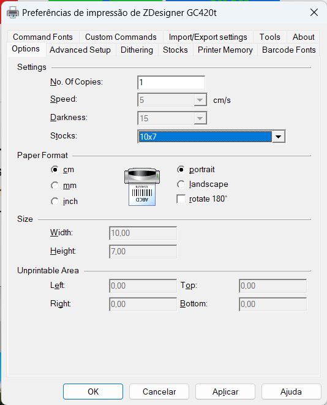
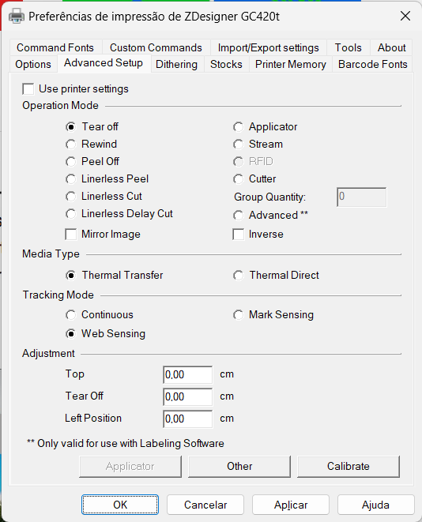

# Configuração de impressora Zebra

Configurações para impressora térmica de etiquetas Zebra.

Antes de fazer as configurações é necessário que o driver da impressora esteja instalado.

<https://www.zebra.com/br/pt/support-downloads.html>

## Configuração do papel

Na tela de preferências da impressora, aba "Stocks", clique em "New...".

Informe um nome para a etiqueta e as medidas em cm e clique em "OK".

As medidas têm que bater exatamente com as medidas da etiqueta, inclusive as bordas.

Na aba "Options", informe o modelo da etiqueta.

Na aba "Advanced Setup", habilite a opção "Web Sensing" para ativar o sensor de quebra de página

## Impressora pulando etiquetas

É necessário calibrar a impressora no botão de "feed" e na tela de preferências